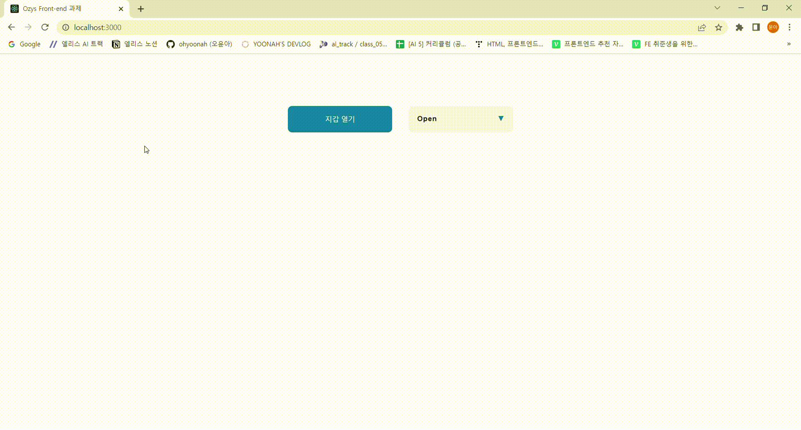
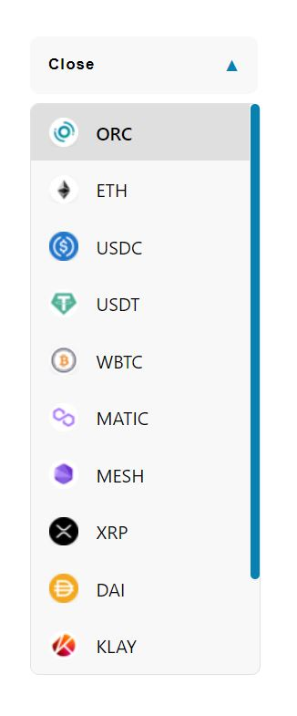
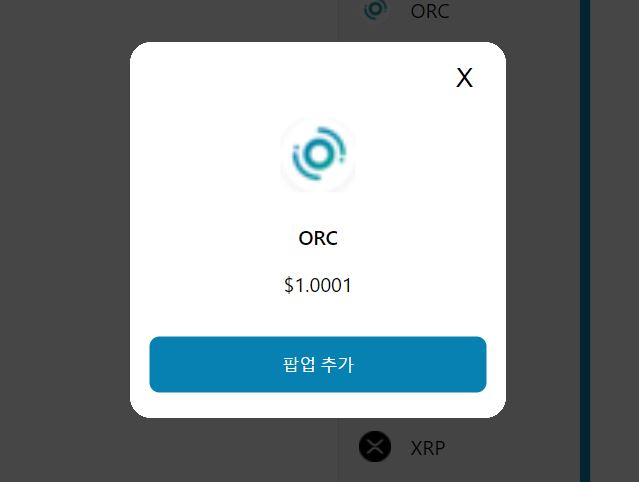
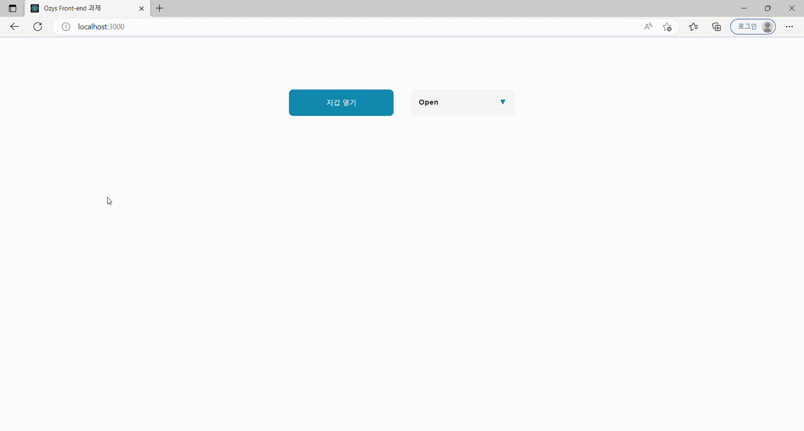
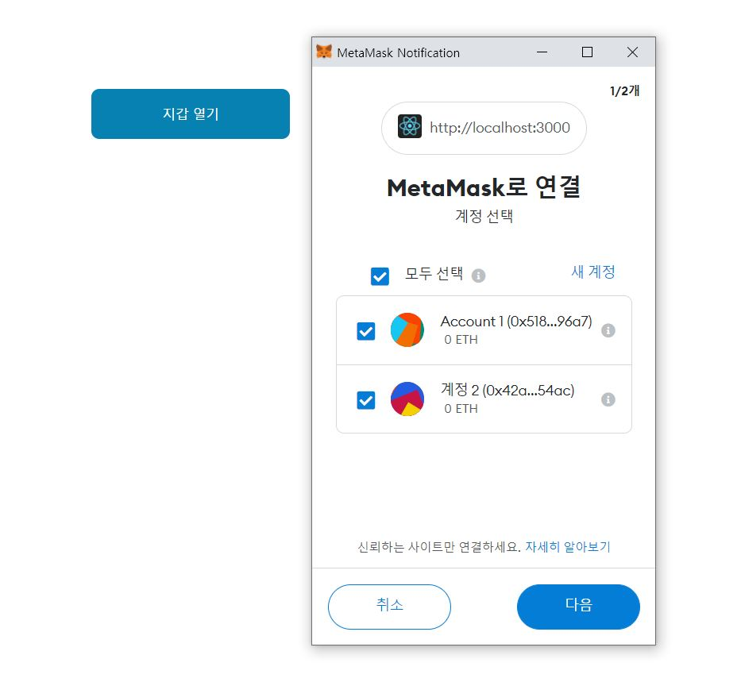

# 오윤아 Ozys Front-end 과제

## 목차

[프로젝트 정보](#프로젝트-정보)
  - [설치 방법](#설치-방법)
  - [기술 스택](#기술-스택)
  - [디렉토리 구조](#디렉토리-구조)

[프로젝트 결과](#프로젝트-결과)
  - [1. React로 드롭다운 만들기](#1-react로-드롭다운-만들기)
  - [2. 팝업 컴포넌트 구현하기](#2-팝업-컴포넌트-구현하기)
  - [3. 크롬 플러그인(Metamask) 연결하여 연동하기](#3-크롬-플러그인metamask-연결하여-연동하기)

## 프로젝트 정보

본 과제에 사용된 데이터(드롭다운 메뉴 아이템 데이터)는 오르빗 브릿지(https://bridge.orbitchain.io) 사이트를 참조하여 제작했습니다.

과제가 유출될 우려가 있어 별도의 블로그 포스팅을 하지 않고 리드미에 간략하게 정리했습니다.

과제 진행 시 Github 레포지토리는 비공개로 설정하였으며, 제출을 위해 잠시 공개로 변경하였습니다.




### 설치 방법

```
yarn
yarn start
```

### 기술 스택

`Typescript` `React` `styled-components` `Recoil`

### 디렉토리 구조

```
ozys
├─ .gitignore
├─ .prettierrc
├─ package.json
├─ public
│  ├─ favicon.ico
│  ├─ index.html
│  ├─ manifest.json
│  └─ robots.txt
├─ README.md
├─ src
│  ├─ App.test.tsx
│  ├─ App.tsx
│  ├─ atoms
│  │  ├─ dropState.ts
│  │  └─ metaMaskState.ts
│  ├─ components
│  │  ├─ common
│  │  │  └─ buttonStyle.ts
│  │  ├─ dropdown
│  │  │  ├─ Dropdown.tsx
│  │  │  └─ dropStyle.ts
│  │  ├─ metamask
│  │  │  ├─ MetaMask.tsx
│  │  │  ├─ metaMaskStyle.ts
│  │  │  └─ Wallet.tsx
│  │  └─ popup
│  │     ├─ Popup.tsx
│  │     └─ popupStyle.ts
│  ├─ data
│  │  └─ items.ts
│  ├─ index.css
│  ├─ index.tsx
│  ├─ react-app-env.d.ts
│  └─ reportWebVitals.ts
├─ tsconfig.json
└─ yarn.lock
```

- **public**: 리드미에 사용된 이미지가 들어 있습니다.
- **atoms**: `Recoil`을 사용해 전역 상태관리를 위한 디렉토리 입니다.
- **components**: 드롭다운, 팝업, 지갑 컴포넌트들과 스타일 파일이 있습니다.
- **data**: 드롭다운 리스트 아이템의 데이터를 작성했습니다.

---

## 프로젝트 결과

#### 1. React로 드롭다운 만들기



- `src/data/items.ts` 파일 안에 드롭다운 메뉴 리스트에 들어갈 데이터를 분리한 뒤 `import` 해서 사용했습니다.

<br>

- `src/atoms/dropState.ts` 파일 안에 `Recoil` 상태관리 라이브러리를 사용해서 전역 상태관리를 했습니다.

<br>

- 드롭다운 버튼을 클릭하면 버튼 텍스트가 바뀌고 화살표 방향도 180도 회전하도록 했습니다.

<br>

- `useRef`를 사용해 드롭다운이 열린 상태에서 드롭다운 리스트 외부 영역을 클릭하면 드롭다운이 닫히도록 했습니다.
- `click`이벤트 대신 `mousedown`이벤트를 사용해서 클릭과 동시에 이벤트가 발생하도록 했습니다.

<br>

- 데이터가 담긴 `items`를 `map` 메서드를 사용하여 모든 요소를 순회해 가며 리스트로 나타냈습니다.

<br>

- 리스트 아이템 하나의 크기를 `50px`로 지정하고, 총 리스트의 길이를 `calc(50px * 10)`으로 해서 10개의 아이템이 보여지게 했습니다.
- 리스트에 `overflow-y: auto`를 넣어서 해당 길이를 초과하면 스크롤이 생기도록 만들어 주었습니다.

<br>

- 리스트 아이템을 클릭하면 각 아이템에 해당하는 이미지, 이름, 가격 정보등 로우 데이터를 팝업창으로 띄워 주었습니다.

<br>

#### 2. 팝업 컴포넌트 구현하기



- 드롭다운 리스트 아이템을 클릭하면 팝업창을 띄워 주었습니다.

<br>

- `styled-components`로 `Overlay` 스타일 컴포넌트를 만들어 팝업창이 뜨면 배경이 어두워지는 효과를 구현했습니다.

<br>

- 각 팝업창에는 닫기 버튼과 팝업 추가 버튼을 만들었습니다.
- 닫기 버튼을 클릭하면 해당 팝업과 오버레이가 닫힙니다.
- 팝업 추가 버튼을 클릭하면 새로운 팝업과 오버레이가 추가됩니다.

<br>

- 더 나중에 표시되는 팝업일수록 화면 상에서 더 높은 우선도를 가지며 이전에 표시된 팝업보다 위에 표시되도록 했습니다.

<br>

- 세 번째 팝업에서 팝업 추가 버튼을 클릭하면 팝업은 최대 세 개라는 `alert` 메시지를 띄워 주었습니다.

<br>

- 드롭다운과 마찬가지로 외부 영역을 클릭하면 해당 팝업이 닫히도록 했습니다.
- 드롭다운과 다른 점은 여러 개의 `useRef`를 사용했다는 점입니다.
- 외부 영역이 겹쳐 세 개의 팝업이 한꺼번에 닫힘을 방지하기 위해 `ref`값을 오버레이 컴포넌트에 지정했습니다.
- 오버레이 컴포넌트에 지정했기 때문에, 외부 영역 클릭을 감지하는 것이 아닌 해당 영역을 클릭하면 팝업이 닫히도록 구현했습니다.

<br>

#### 3. 크롬 플러그인(Metamask) 연결하여 연동하기

> 설치 전



> 설치 후



- Metamask와의 연결을 위해 `ethers` 라이브러리를 사용했습니다.
- `ehters.providers`를 통해 이더리움 노드를 연결하고 상태에 저장해 주었습니다.
- `eth_requestAccounts`를 통해 계정과의 연동을 요청했습니다.

- 지갑 열기 버튼을 클릭하면 Metamask에서 현재 선택된 계정을 가져옵니다.
- `window.ethereum`로 Metamask의 설치 여부를 확인해서 미설치 시 `alert` 창을 띄운 후 설치 페이지로 이동하도록 구현했습니다.
- `Typescript`에서는 `ethereum` 타입을 바로 알 수 없기 때문에 `react-app-env.d.ts` 파일에 타입을 지정해 주었습니다.

<br>

- 지갑 연결이 성공하면 팝업 창을 띄워 선택된 계정 주소와 그 계정의 `ETH` 보유 수량이 표시되도록 했습니다.
- `balance: Number(ethers.utils.formatEther(result[1]))`로 보유 잔고 값에 이더리움 단위로 표현되도록 했습니다.
- 네트워크 변경도 표시하기 위해 `chainId`값도 표시해 주었습니다.

<br>

- 계정 주소의 변경을 감지하기 위해 이더리움의 `accountsChanged` 리스너를 사용했습니다.
- 변경된 계정이 상태에 저장되어 있는 계정과 일치하지 않을 경우 변경된 계정으로 바꿔 주었습니다.

<br>

- 네트워크 변경 역시 같은 방법으로 값의 변경을 즉시 나타내 주었습니다.
- 하지만 모든 RPC 요청은 현재 연결된 체인 네트워크에 요청되어 현재 체인 ID를 추적하는 것이 중요합니다.
- 따라서 `Metamask` 공식 문서에서는 `window.location.reload()`를 이용해서 페이지를 다시 로드하는 것을 권장하고있습니다.

<br>

- 지갑이 연결된 후 받은 데이터의 이더리움 메인넷의 네트워크 값인 `chainId`값이 1(이더리움 메인넷 `chainId`값)일 경우 이더리움 메인넷에 연결되었다는 `alert`을 띄워 주었습니다.
- `useEffect`를 사용해서 `chainId`값이 변경될 때마다 확인할 수 있도록 했습니다.
